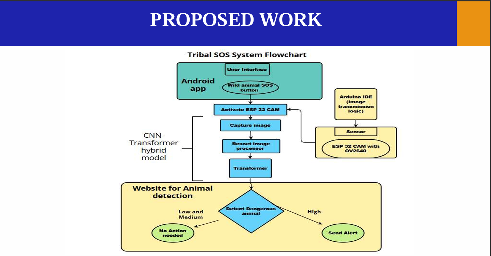

# Wild Animal Detection and Emergency Communication System

A deep learning + IoT system for wildlife detection and emergency alerts in remote tribal areas with limited connectivity.

## Overview

This project builds a real-time wildlife detection and emergency communication system for tribal communities in remote regions. It combines AI models (ResNet50, CNNs, Transformers) with IoT sensors and uses RF/mesh networking to deliver alerts even without internet access.

## Key Features

**Wildlife Detection:**
- ResNet50, CNN, and Transformer models for animal classification
- Identifies carnivorous vs. non-carnivorous species
- Danger level classification

**IoT Integration:**
- Motion sensors (IR), ESP32-CAM, DHT11/22
- Real-time environmental monitoring
- Low-power operation for remote deployment

**Offline Communication:**
- RF modules and mesh networks for areas without internet
- Works in no-connectivity zones

**Mobile App:**
- Flutter app for SOS alerts and real-time notifications
- Community safety features

## Tech Stack

- **AI/ML:** ResNet50, CNN, Transformers, TensorFlow, PyTorch
- **IoT:** ESP32-CAM, IR Sensor, DHT11/22
- **Communication:** RF Modules, Mesh Network
- **Software:** Python, OpenCV, Keras, Flutter, SQLite

## Model Outputs

## System Architecture

The system has three main modules:

1. Detection & Sensing Module
2. AI Processing Module
3. Alert & Response Module

## How It Works

1. Sensors detect motion and environmental conditions
2. ESP32-CAM captures images
3. AI classifies species and danger level
4. RF/Mesh network sends alerts to mobile app
5. SOS feature for emergency communication

## Results

- High detection accuracy with ResNet50 + Transformer hybrid
- Good precision and recall for danger classification
- Effective under low-power constraints
- Successfully deployed in low-connectivity regions
