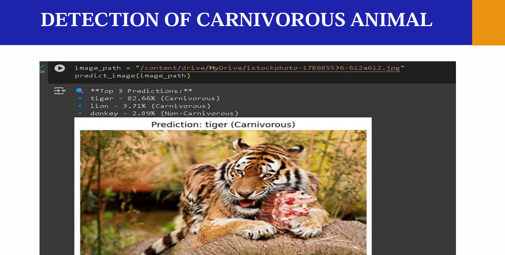
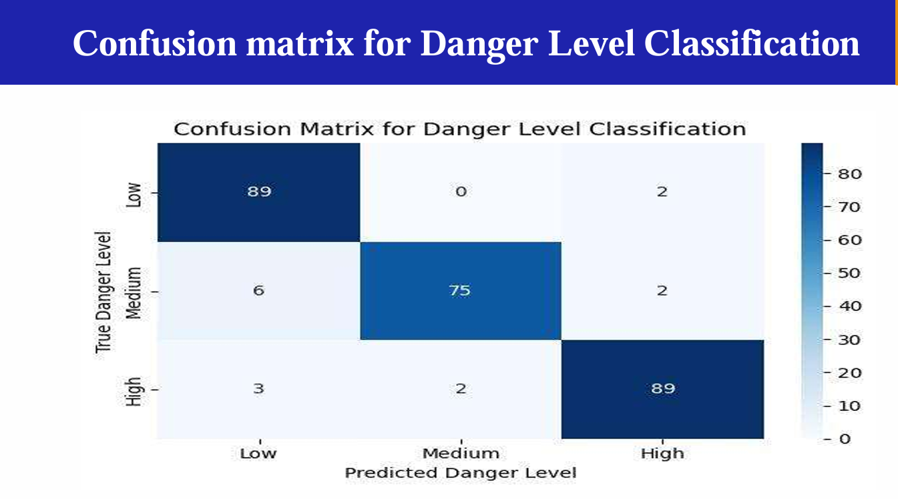

 🐾 Seamless Emergency Communication & Wild Animal Detection

A Deep Learning + IoT System for Off-Grid Tribal Safety

This project focuses on building a real-time wildlife detection and emergency communication system for tribal communities living in remote regions with limited connectivity. The system combines AI models (ResNet50, Transformers) with IoT motion and thermal sensors, and uses RF/Mesh networking to deliver alerts even without internet access.

---

🚀 Key Features

### Wild Animal Detection
- Uses ResNet50, CNN, and Transformer models to classify animals.
- Identifies carnivorous vs. non-carnivorous species.

### Danger Level Classification
- Models analyze patterns and assign threat levels for immediate decision-making.

### IoT-Driven Alerts
- Motion sensors (IR), ESP32-CAM, DHT11/22, and environmental sensors trigger real-time alerts.

### Offline Communication
- Alerts transmitted via RF modules / mesh networks for areas without mobile or internet coverage.

### Mobile App Integration
- Flutter app for SOS alerts, real-time notifications, and community safety features.

---

🧠 Tech Stack

**AI / ML:** ResNet50, CNN, Transformers, TensorFlow / PyTorch  
**IoT:** ESP32-CAM, IR Sensor, DHT11/22  
**Communication:** RF Modules, Mesh Network  
**Software:** Python, OpenCV, Keras, Flutter, SQLite

---

 📊 Model Outputs

---

 🏗️ System Architecture

The system is divided into three main modules:

1. Detection & Sensing Module 
2. AI Processing Module  
3. Alert & Response Module

---

## 📝 How It Works

1. Sensors detect motion / environmental conditions.  
2. ESP32-CAM captures images.  
3. AI classifies species & danger level.  
4. RF/Mesh network sends alerts to the mobile app.  
5. SOS feature triggers emergency communication.

---

## 🧪 Results

- Improved detection accuracy using ResNet50 + Transformer hybrid.  
- Danger classification demonstrated high precision and recall.  
- System worked effectively under low-power constraints.  
- Supports deployment in low-connectivity tribal regions.

---

Made with ❤️ for Tribal Safety & Wildlife Protection
